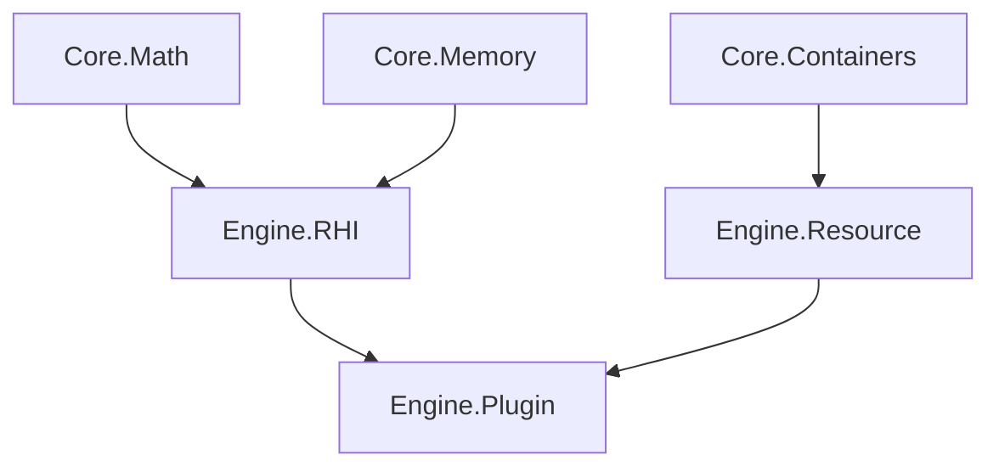

# Getting Started with Akhanda Engine

## Prerequisites

- **Visual Studio 2022** (v17.5 or later)
- **Windows SDK** 10.0.22621.0 or later
- **Git** for version control
- **Akhanda repository** already cloned

## Initial Setup

### 1. Verify Development Environment

Open Visual Studio Installer and ensure these components are installed:
- MSVC v143 - VS 2022 C++ x64/x86 build tools
- Windows 11 SDK (10.0.22621.0)
- C++ CMake tools (optional, for third-party libraries)

### 2. Open the Solution

1. Navigate to your cloned Akhanda directory
2. Open `Akhanda.slnx` in Visual Studio 2022
3. Wait for IntelliSense to initialize (may take 2-3 minutes on first load)

### 3. Configure Build Settings

**Set Configuration:**
- Select `Debug` configuration for development
- Select `x64` platform (only supported platform)
- Set `Editor` as startup project (right-click → Set as Startup Project)

## First Build

### 1. Clean Build Process

```bash
# From Visual Studio Developer Command Prompt
cd /path/to/Akhanda
msbuild Akhanda.sln /t:Clean /p:Configuration=Debug /p:Platform=x64
msbuild Akhanda.sln /t:Build /p:Configuration=Debug /p:Platform=x64
```

**Expected Build Order:**
1. Engine (static library)
2. Plugins (dynamic libraries) 
3. Editor (executable)
4. Game (executable)

### 2. Verify Build Success

Check these output directories:
```
Build/Output/Bin/x64/Debug/
├── Engine_Debug.lib      # Core engine library
├── Editor_Debug.exe      # Engine editor
├── ThreadsOfKaliyuga_Debug.exe  # Game executable
├── ImGuiPlugin_Debug.dll # UI plugin
├── PhysXPlugin_Debug.dll # Physics plugin
└── ONNXPlugin_Debug.dll  # AI plugin
```

## Running the Engine

### 1. Launch Editor

Press `F5` or click "Start Debugging" to launch the Editor.

**Expected Behavior:**
- Window creation with title "Akhanda Editor"
- ImGui interface initialization
- Plugin loading messages in output
- Basic 3D viewport (black screen initially)

### 2. Launch Game

1. Right-click `ThreadsOfKaliyuga` project
2. Select "Set as Startup Project"  
3. Press `F5` to run the game

## Understanding the Module System

### 1. Engine Modules

The engine uses C++23 modules for clean interfaces:

```cpp
// Example: Using math module in your code
import Core.Math;

// Now you can use:
Vector3 position{1.0f, 2.0f, 3.0f};
Matrix4 transform = Matrix4::Identity();
```

### 2. Available Modules

- `Core.Math` - SIMD-optimized math operations
- `Core.Memory` - Custom allocators and memory tracking
- `Core.Containers` - STL-compatible containers
- `Engine.RHI` - Render Hardware Interface (D3D12)
- `Engine.Resource` - Asset loading and management
- `Engine.Plugin` - Plugin system API

### 3. Module Dependencies



## Creating Your First Plugin

### 1. Plugin Structure

```cpp
// MyPlugin/Source/Plugin.cpp
import Engine.Plugin;

class MyFirstPlugin : public IPlugin {
public:
    void OnLoad() override {
        // Plugin initialization
        LogInfo("MyFirstPlugin loaded!");
    }
    
    void OnUnload() override {
        // Cleanup
        LogInfo("MyFirstPlugin unloaded!");
    }
    
    const char* GetName() const override {
        return "MyFirstPlugin";
    }
};

// Export function for plugin loading
extern "C" __declspec(dllexport) IPlugin* CreatePlugin() {
    return new MyFirstPlugin();
}
```

### 2. Plugin Project File

Create `MyPlugin/MyPlugin.vcxproj`:

```xml
<?xml version="1.0" encoding="utf-8"?>
<Project DefaultTargets="Build" xmlns="http://schemas.microsoft.com/developer/msbuild/2003">
  <ImportGroup Label="PropertySheets">
    <Import Project="..\..\Build\Props\Plugin.props" />
    <Import Project="..\..\Build\Props\ThirdParty.props" />
  </ImportGroup>
  
  <ItemDefinitionGroup>
    <ClCompile>
      <PreprocessorDefinitions>MYPLUGIN_EXPORTS;%(PreprocessorDefinitions)</PreprocessorDefinitions>
    </ClCompile>
  </ItemDefinitionGroup>
  
  <ItemGroup>
    <ClCompile Include="Source\Plugin.cpp" />
  </ItemGroup>
  
  <ItemGroup>
    <ProjectReference Include="..\..\Engine\Engine.vcxproj">
      <Project>{6EBA6490-35F7-4578-B7E8-EEA36BA09570}</Project>
    </ProjectReference>
  </ItemGroup>
</Project>
```

## Working with Assets

### 1. Asset Directory Structure

```
Game/Assets/
├── Meshes/          # 3D models (.fbx, .obj)
├── Textures/        # Images (.png, .jpg, .dds)
├── Materials/       # Material definitions (.mat)
├── Scripts/         # Lua scripts (.lua)
├── Audio/           # Sound files (.wav, .ogg)
└── AI/              # ONNX models (.onnx)
```

### 2. Loading Assets

```cpp
import Engine.Resource;

// Load a mesh
auto mesh = ResourceManager::LoadMesh("Assets/Meshes/character.fbx");

// Load a texture
auto texture = ResourceManager::LoadTexture("Assets/Textures/diffuse.png");

// Load an AI model
auto aiModel = ResourceManager::LoadAIModel("Assets/AI/behavior_tree.onnx");
```

## Development Workflow

### 1. Daily Development

```bash
# 1. Pull latest changes
git pull origin main

# 2. Clean and rebuild (if needed)
msbuild /t:Clean,Build /p:Configuration=Debug

# 3. Run editor for testing
# Press F5 in Visual Studio

# 4. Run automated tests (when available)
# Tests/RunAllTests.exe
```

### 2. Adding New Features

1. **Plan the module** - Decide if it belongs in Core or Engine
2. **Create interface** - Define public API in module interface
3. **Implement** - Add implementation files
4. **Update build** - Modify relevant .vcxproj files
5. **Test** - Verify functionality in Editor or Game

### 3. Plugin Development Cycle

1. **Create plugin project** using Plugin.props template
2. **Implement IPlugin interface**
3. **Add to solution** and build
4. **Test loading** in Editor
5. **Integrate** with engine systems

## Configuration Management

### 1. Build Configurations

- **Debug** - Full debugging, no optimization
- **Release** - Full optimization, minimal debug info
- **Profile** - Optimized with profiling markers

### 2. Preprocessor Definitions

Each configuration defines specific macros:

```cpp
#ifdef AKH_DEBUG
    // Debug-only code
    #define DBG_BREAK() __debugbreak()
#endif

#ifdef AKH_PROFILE
    // Profiling markers
    PROFILE_SCOPE("FunctionName");
#endif
```

## Troubleshooting

### Common Build Issues

**Issue: "Module not found" errors**
```
Solution: 
1. Clean solution (Build → Clean Solution)
2. Delete Build/Output/Intermediate directory
3. Rebuild solution
```

**Issue: Plugin loading failures**
```
Symptoms: Plugin DLL not found or entry point missing
Solutions:
1. Verify plugin exports CreatePlugin() function
2. Check output directory contains plugin DLL
3. Ensure plugin links against Engine.lib
```

**Issue: C++23 features not recognized**
```
Solution:
1. Verify LanguageStandard is set to 'stdcpplatest'
2. Check PlatformToolset is v143
3. Update Visual Studio to latest version
```

### Performance Issues

**Slow compilation:**
```
Solutions:
1. Enable multi-processor compilation (/MP flag)
2. Use precompiled headers for large headers
3. Minimize #include dependencies in headers
```

**Runtime performance:**
```
Debugging:
1. Use Profile configuration for performance testing
2. Enable CPU profiling in Visual Studio
3. Check GPU usage with D3D12 debug layers
```

### Debugging Tips

**Module debugging:**
```cpp
// Enable module debugging in Debug configuration
#ifdef AKH_DEBUG
    #pragma message("Compiling module: " __FILE__)
#endif
```

**Plugin debugging:**
```cpp
// Add to plugin OnLoad():
#ifdef AKH_DEBUG
    OutputDebugStringA("Plugin loaded: MyPlugin\n");
#endif
```

**Memory debugging:**
```cpp
// Engine provides memory tracking in Debug builds
#ifdef AKH_DEBUG
    MemoryTracker::DumpLeaks(); // Call before shutdown
#endif
```

## Next Steps

1. **Explore the Architecture Guide** - Understand engine systems
2. **Follow Plugin Development Guide** - Create AI-powered features  
3. **Study existing plugins** - Learn from ImGui and PhysX implementations
4. **Join development discussions** - Contribute to engine evolution

## Quick Reference

### Essential VS Shortcuts
- `F5` - Build and run
- `F7` - Build solution
- `Ctrl+Shift+B` - Build current project
- `F9` - Toggle breakpoint
- `F10/F11` - Step over/into

### Useful MSBuild Commands
```bash
# Build specific project
msbuild Engine/Engine.vcxproj /p:Configuration=Debug

# Build with verbose output  
msbuild /verbosity:detailed

# Build multiple configurations
msbuild /p:Configuration="Debug;Release"
```

### Important File Locations
- Engine interfaces: `Engine/**/*.ixx`
- Build configuration: `Build/Props/*.props`
- Third-party libs: `ThirdParty/lib/x64/`
- Output binaries: `Build/Output/Bin/x64/`