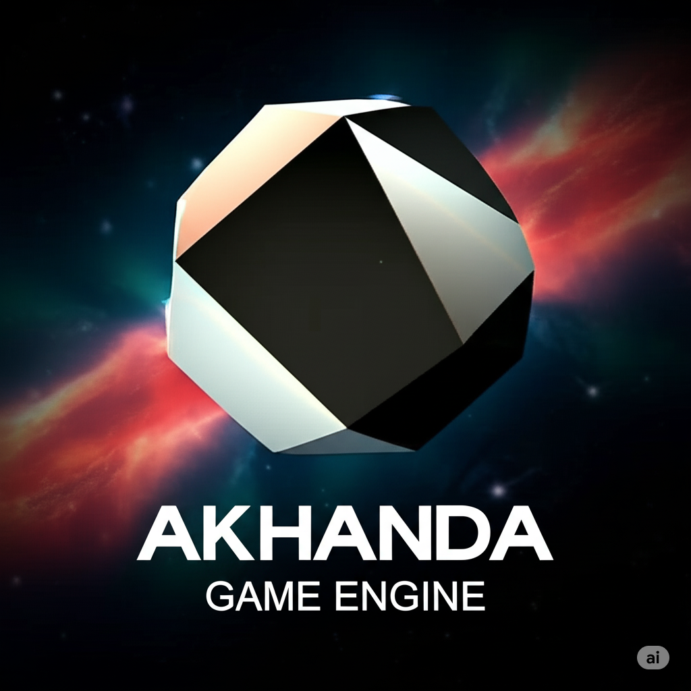


# <center> [ Akhanda ] Game Engine </center>

<div style="margin: 0 auto; height: 70vh; overflow:hidden; background:black; background: radial-gradient(ellipse at center, #01050b 0%, #000000 100%); display: flex; justify-content: center; align-items: center; background-repeat: no-repeat; background-attachment: fixed; background-size: cover;">

</div>

---

A modular, plugin-based 3D game engine built with C++23 and designed for AAA-quality games. Features AI as a first-class system and includes an integrated editor.

---

## Features

- **Modern C++23** with module support
- **Plugin Architecture** for extensibility
- **D3D12 Renderer** with support for modern graphics features
- **AI-First Design** with ONNX Runtime integration
- **Integrated Editor** built with Dear ImGui
- **Job System** for parallel execution
- **Entity Component System** for game objects
- **Advanced Asset Pipeline** with hot-reload support

## Requirements

- Windows 10/11 (64-bit)
- Visual Studio 2022 (v17.5+)
- Windows SDK 10.0.22621.0+

## Quick Start

1. **Clone the repository**
   ```bash
   git clone https://github.com/Derthenier/Akhanda.git
   cd Akhanda
   ```

2. **Open solution**
   - Open `Akhanda.slnx` in Visual Studio 2022
   - Set `Editor` as startup project
   - Build and run (F5)

## Project Structure

```
Akhanda/
├── Engine/          # Core engine (static library)
├── Plugins/         # Engine plugins (DLLs)
├── Editor/          # Standalone editor application
├── Game/            # Your game project
├── ThirdParty/      # External dependencies
└── Build/           # Build scripts and output
```

## Architecture

### Core Systems
- **Memory**: Custom allocators with tracking
- **Math**: SIMD-optimized math library
- **Threading**: Job system with work-stealing
- **Resources**: Async asset loading with caching

### Engine Modules
```cpp
import Core.Math;        // Vectors, matrices, quaternions
import Core.Memory;      // Allocators and memory management
import Engine.RHI;       // Render hardware interface
import Engine.Resource;  // Asset management
import Engine.Plugin;    // Plugin system API
```

### Plugin System
Create custom plugins by inheriting from `IPlugin`:
```cpp
class MyPlugin : public IPlugin {
    void OnLoad() override;
    void OnUnload() override;
};
```

## Building from Source

### Debug Build
```bash
msbuild Akhanda.sln /p:Configuration=Debug /p:Platform=x64
```

### Release Build
```bash
msbuild Akhanda.sln /p:Configuration=Release /p:Platform=x64
```

### Profile Build (with profiling markers)
```bash
msbuild Akhanda.sln /p:Configuration=Profile /p:Platform=x64
```

## Getting Started with Development

1. **Create a Window** - See `Engine/Core/Platform/Windows/`
2. **Initialize Renderer** - See `Engine/Renderer/RHI/`
3. **Load Assets** - See `Engine/Resources/`
4. **Create Entities** - Use the ECS in `Engine/Systems/`

## Third-Party Libraries

- **Rendering**: D3D12, Vulkan (planned)
- **Physics**: Jolt Physics
- **UI**: Dear ImGui
- **AI/ML**: ONNX Runtime
- **Audio**: FMOD/Wwise
- **Scripting**: Lua (sol3)

## Contributing

1. Fork the repository
2. Create a feature branch (`git checkout -b feature/amazing-feature`)
3. Commit your changes (`git commit -m 'Add amazing feature'`)
4. Push to the branch (`git push origin feature/amazing-feature`)
5. Open a Pull Request

### Coding Standards
- Follow C++ Core Guidelines
- Use modules for new interfaces
- Maintain 100% warning-free compilation
- Add unit tests for new features

## Documentation

- [Getting Started Guide](Documentation/GettingStarted.md)
- [Architecture Overview](Documentation/Architecture/Overview.md)
- [Plugin Development](Documentation/Plugins.md)
- [Roadmap](Documentation/Roadmap.md)

## License

This project is licensed under the MIT License - see [LICENSE](LICENSE) file for details.

## Acknowledgments

- Inspired by Unreal Engine, Unity, and Godot architectures
- Built for the game "Threads of Kaliyuga"

---

**Note**: This engine is under active development. APIs may change.

**Note**: Copyright :copyright: 2025. Aditya Vennelakant. All rights reserved.
